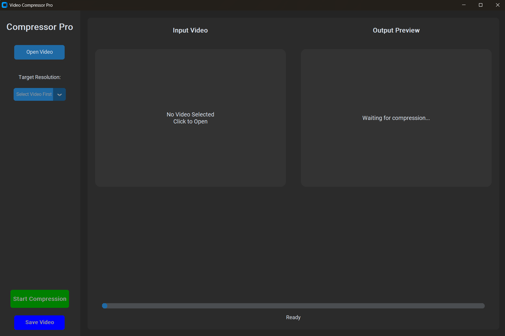

# Video Compressor Pro 🎬


A beautiful, **Offline** Desktop application to compress videos to various resolutions (144p to 1440p) with live preview.



## Features
- **100% Offline**: No internet required. Runs locally on your machine.
- **Modern UI**: Built with CustomTkinter for a sleek, dark-mode experience.
- **Preview First**: Compress and preview the video quality *before* you save.
- **Resolution Control**: Choose from 144p up to 1440p.

## Prerequisites
1. **Python 3.8+** installed.
2. (Optional) **FFmpeg** is **NOT** required to be manually installed anymore. The app includes it automatically.

## Installation
Two easy ways to setup:

### Option 1: Automatic Setup (Windows)
Double-click `setup_env.bat`. This will:
1. Create a virtual environment (`venv`).
2. Install necessary libraries.
3. Show you how to run the app.

### Option 2: Manual Setup
```bash
# Create virtual environment
python -m venv venv

# Activate it (Windows)
venv\Scripts\activate

# Install dependencies (automatically installs ffmpeg binary)
pip install -r requirements.txt
```

## Running the App
Once installed (and environment activated):
```bash
python app.py
```
This will open the application window.

## How to Use
1. Click **Open Video** to select a file.
2. Select your target **Resolution** (e.g., 720p).
3. Click **Start Compression**.
4. Wait for the process to finish. The **Output Preview** will appear.
5. If satisfied, click **Save Video** to save the file to your computer.

## Tech Stack
- **CustomTkinter**: For the modern desktop UI.
- **OpenCV & Pillow**: For image processing and video previews.
- **imageio-ffmpeg**: Bundled FFmpeg binary for offline compression.

## Running Tests
To run the included unit tests for the backend logic:
```bash
python tests.py
```
```
(Ensure your virtual environment is activated)

## Building for Distribution
To create a standalone `.exe` file that users can run without installing Python:

1. Double-click `build_exe_v2.bat`.
2. Wait for the process to finish.
3. You will find the file `VideoCompressorPro.exe` inside the `dist` folder.

**Publishing to GitHub:**
1. Go to your repository on GitHub.
2. Click **Releases** on the right sidebar.
3. Click **Draft a new release**.
4. Drag and drop `dist/VideoCompressorPro.exe` into the upload box.
5. Publish!
